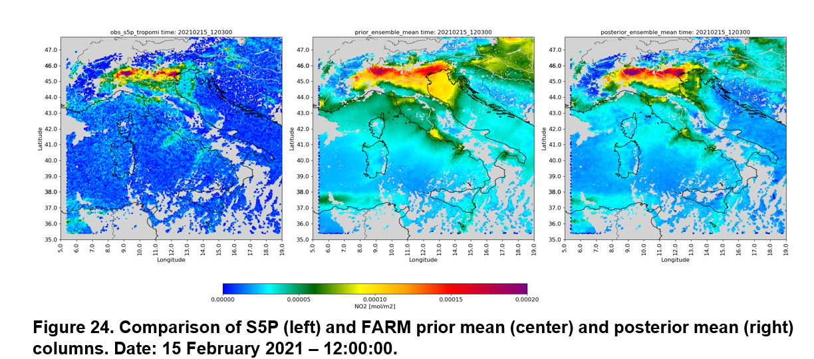

# DART - FARM

Welcome to DART-FARM, a fork of the **Data Assimilation Research Testbed** that implements the Chemical Transport Model **FARM** in DART.
For more info about FARM:
[FARM model](http://www.farm-model.org/)
[FORAIR-IT model](https://clima.sostenibilita.enea.it/research/FORAIR-IT)

### **DART-FARM Model Implementation**
For information specific to the **DART-FARM** implementation, refer to the `README.md` file located in:  
**`models/FARM/README.md`**

For all the info related to DART please refer to the main repository and its documentation
[The DART documentation is available online](https://dart-documentation.readthedocs.io/en/latest/).

## :busts_in_silhouette: About Us
**Organizations**
- [ENEA](https://www.enea.it/it)
- [Arianet srl](https://www.aria-net.it/it/)
- [SUEZ]()

**Team**
- Alessandro D’Ausilio, [ResearchGate](), [LinkedIn]()
